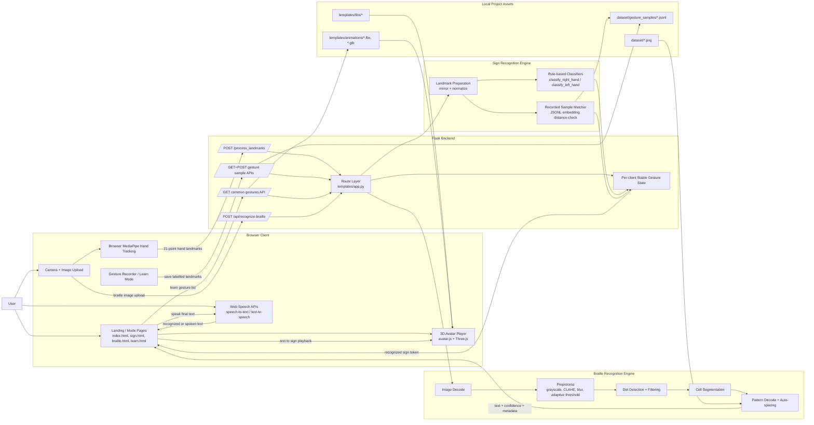

# SAMVAAD System Architecture

This diagram reflects the current code structure in `templates/app.py`, `sign_recog.py`, `samvaad_braille.py`, and `templates/avatar.js`.

## Reading The Diagram

- The browser handles camera access, MediaPipe landmark extraction, speech input/output, and 3D sign playback.
- Flask serves both the static UI files and the JSON APIs used by sign recognition, Braille recognition, learn mode, and gesture sample recording.
- Sign recognition is hybrid: browser-side landmark capture plus server-side rule-based classification, recorded-sample matching, and temporal stabilization.
- Braille recognition is fully server-side and runs as an image-processing pipeline from upload to decoded text.
- Local assets power both inference and presentation: gesture samples in `dataset/gesture_samples`, Braille examples in `dataset`, and avatar animations in `templates/animations`.
